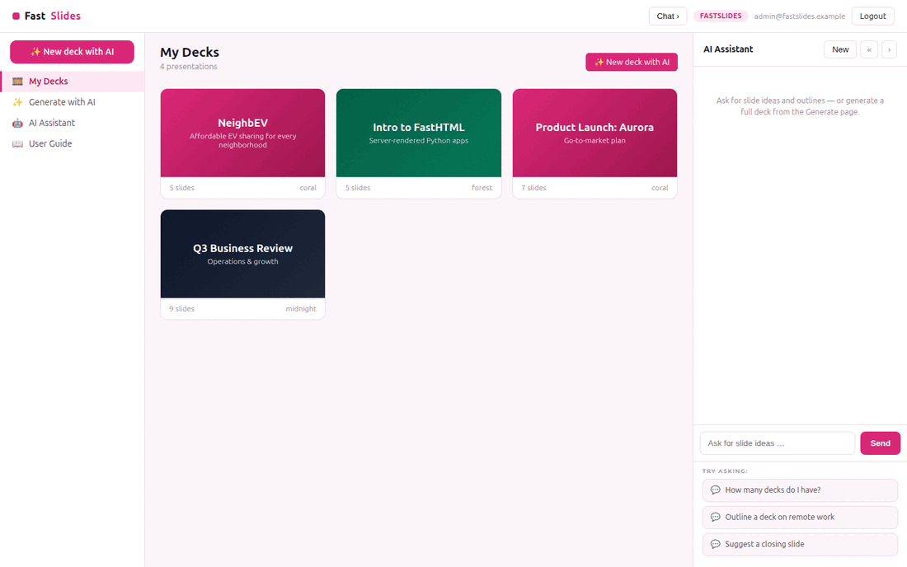

# FastSlides

**FastSlides** is an open-source **presentation builder** built with
[FastHTML](https://fastht.ml) — a server-side, HTMX-driven port of the core of
[Frappe Slides](https://github.com/frappe/slides). Python-first, no JavaScript
framework: a deck library, a slide editor with a live themed canvas, a
full-screen present mode, and **AI deck generation from a prompt**.

*Decks at the speed of thought.* Runs on port **5013**.

> **Synthetic data only.** Sample decks are generated by `seed.py`; everything is
> synthetic.

## Demo



## Quickstart (native)

```bash
python -m venv .venv
.venv/bin/python -m pip install -r requirements.txt
cp .env.sample .env          # add an LLM key to enable AI deck generation
.venv/bin/python web_app.py  # http://localhost:5013  (self-seeds on first boot)
```

Login: `admin@fastslides.example` / `FastSlides2026$`. Reseed with
`.venv/bin/python seed.py`.

## Run with Docker

```bash
docker compose up --build      # http://localhost:5013
```

`Dockerfile` (python:3.12-slim, port 5013) seeds on first boot;
`docker-compose.yml` mounts a `fastslides-data` volume at `/data`.

## Module tour

- **My Decks** (`/`) — your presentations as themed cover tiles.
- **Editor** (`/deck/{id}`) — slide thumbnails on the left, a **live 16:9 themed
  slide canvas** in the centre (Markdown body rendered), and an edit form (layout,
  title, body).
- **Present** (`/present/{id}`) — a full-screen slideshow; **←/→/space** to
  advance, **Esc** to exit.
- **Generate with AI** (`/generate`) — describe a deck, pick a theme + slide
  count, and the AI writes **every slide** then drops you into the editor.
- **AI Assistant** (right rail) — slide ideas, outlines, and rewrites.

## AI deck generation (the showcase)

`/generate` sends your topic to the configured LLM with a strict instruction to
return a **JSON array of slides** (`title`, `body`, `layout`). FastSlides
validates it, creates the presentation, and opens the editor — see the
"NeighbEV" deck in the demo, generated live from a one-line prompt.

```ini
MODEL_PROVIDER=xai          # xai | openai | anthropic | google
MODEL_NAME=grok-4-1-fast-reasoning
XAI_API_KEY=...
```

Without a key, the sample decks, editor and present mode all still work — only
generation is disabled.

## Architecture

```
web_app.py        routes, auth, generate, slide save, present, SSE chat
db.py             SQLite presentations + slides
seed.py           deterministic sample decks
web/layout.py     3-pane shell, slide-canvas CSS, themes, chat JS
web/views.py      deck list, editor, present mode, generate form
web/ai.py         generate_deck() (text→JSON deck) + chat
```

See **[SKILLS.md](SKILLS.md)** and **[docs/ROADMAP.md](docs/ROADMAP.md)**. Part of
the [`fasthtml-oss-migrations`](https://github.com/predictivelabsai/fasthtml-oss-migrations)
initiative.

## Licence

MIT.
