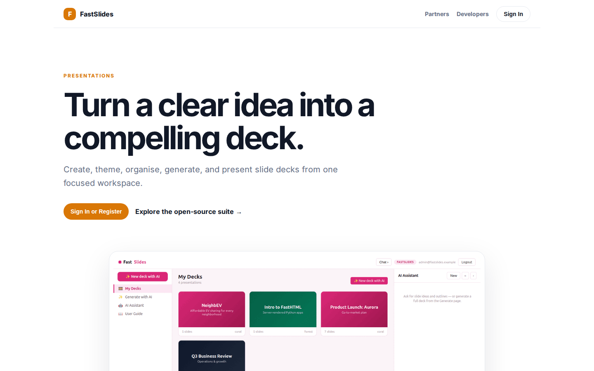
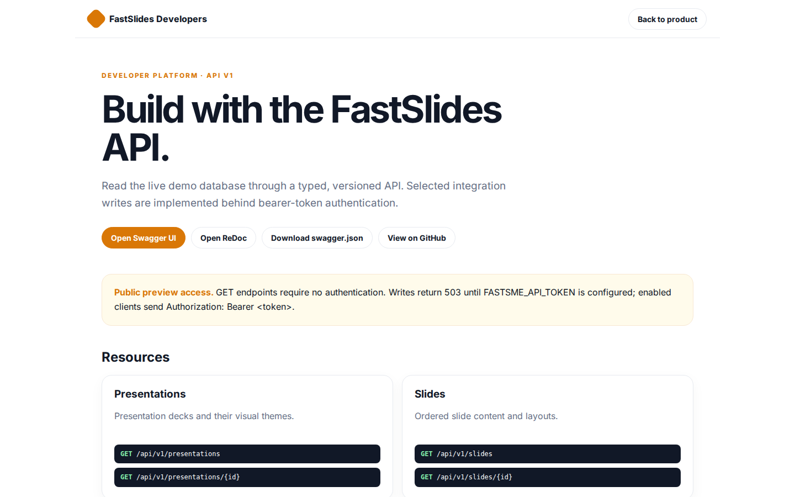

# FastSlides Platform Guide

**Published:** 2026-08-19
**Platform:** [https://slides.fastsme.com](https://slides.fastsme.com)
**Source:** [github.com/predictivelabsai/FastSlides](https://github.com/predictivelabsai/FastSlides)

## Platform overview

**FastSlides** is an open-source **presentation builder** built with — a server-side, HTMX-driven port of the core of . Python-first, no JavaScript framework: a deck library, a slide editor with a live themed canvas, a full-screen present mode, and **AI deck generation from a prompt**.

This visual guide was reviewed against the live product using Playwright. Screens and available navigation can vary by account, role, and deployment configuration.

## 1. Turn a clear idea into a compelling deck.

PRESENTATIONS Turn a clear idea into a compelling deck. Create, theme, organise, generate, and present slide decks from one focused workspace. Sign In or Register Explore the open-source suite → Product tour · see the workspace in action 01 Deck and slide edit

Screen reviewed at: [https://slides.fastsme.com/](https://slides.fastsme.com/)

## 2. Build with the FastSlides API.

FastSlides Developers Back to product DEVELOPER PLATFORM · API V1 Build with the FastSlides API. Read the live demo database through a typed, versioned API. Selected integration writes are implemented behind bearer-token authentication. Open Swagger UI Open Re

Screen reviewed at: [https://slides.fastsme.com/developers](https://slides.fastsme.com/developers)

## 3. Sign in

Sign in with Google Sign in to continue to fastsme.com Email or phone Forgot email? Next Create account Afrikaans azərbaycan bosanski català Čeština Cymraeg Dansk Deutsch eesti English (United Kingdom) English (United States) Español (España) Español (Latinoam

Screen reviewed at: [https://accounts.google.com/v3/signin/identifier?opparams=%253F&dsh=S-536623146%3A1787122859054161&access_type=online&client_id=887059023987-2a7spj1m82eivobdbt1itb3cqca6tpt1.apps.googleusercontent.com&o2v=2&prompt=select_account&redirect_uri=https%3A%2F%2Fslides.fastsme.com%2Fauth%2Fgoogle%2Fcallback&response_type=code&scope=openid+email+profile&service=lso&state=9dTz4OaAs2nPQj3i4aQ_vsj---SrrtvD6fvEQCm9DRs&flowName=GeneralOAuthLite&continue=https%3A%2F%2Faccounts.google.com%2Fsignin%2Foauth%2Flegacy%2Fconsent%3Fauthuser%3Dunknown%26part%3DAJi8hAOLGaPJkUTGYvLciSjqB8yjJyBXy5DV8u8NHz5DDfYyadYE9g-F1symIWDOVBBplBQKA8worU9iPT5VHyeqFB9bxX_X-cAR-fmc3uUNDCubMa0uISYBq7v2kCybG42q9wyssfT8AviCMa1-2ulw60-7VW7UVficsSp8GehCaJkX4Oyy9ShP8S2UtCEC8L_3Eif19M16iY1zUufSbaydPNbtu8AfeuUqNXbPSze9fMKUafzckcIUX0cKTuS6JPv2JpWQlN7TC8b9otil6FbPySBDVXGsEopIiPO6Wb2JNYw-FXfEhDPjuDfjZTg69cjeBit71FiL-Uka0zrZMSn-ICn1xqaVARLxe2xva_GPUOV6OA6_fbsip7JlClL1H7Z30snZC_tOcroS8Z06CSyzNaMQYP4xtjcjv2KiH4fRvW9yOA7ziEOZtL08FeC7yYOTHBMFIEUDGV9Ya0JLp1DZdCnkvGUN4Q%26flowName%3DGeneralOAuthFlow%26as%3DS-536623146%253A1787122859054161%26client_id%3D887059023987-2a7spj1m82eivobdbt1itb3cqca6tpt1.apps.googleusercontent.com%23&app_domain=https%3A%2F%2Fslides.fastsme.com&rart=ANgoxccjjL_rvSfCMaT6DsEXEXdqktgJGTNElx3MiFGOFPg4BKxaH2-RkxHUTOAfumSvRIV3RsCU8hM3plF1_XSXESxizTBHRd184FH5g_2v2CFWD4g_umA](https://accounts.google.com/v3/signin/identifier?opparams=%253F&dsh=S-536623146%3A1787122859054161&access_type=online&client_id=887059023987-2a7spj1m82eivobdbt1itb3cqca6tpt1.apps.googleusercontent.com&o2v=2&prompt=select_account&redirect_uri=https%3A%2F%2Fslides.fastsme.com%2Fauth%2Fgoogle%2Fcallback&response_type=code&scope=openid+email+profile&service=lso&state=9dTz4OaAs2nPQj3i4aQ_vsj---SrrtvD6fvEQCm9DRs&flowName=GeneralOAuthLite&continue=https%3A%2F%2Faccounts.google.com%2Fsignin%2Foauth%2Flegacy%2Fconsent%3Fauthuser%3Dunknown%26part%3DAJi8hAOLGaPJkUTGYvLciSjqB8yjJyBXy5DV8u8NHz5DDfYyadYE9g-F1symIWDOVBBplBQKA8worU9iPT5VHyeqFB9bxX_X-cAR-fmc3uUNDCubMa0uISYBq7v2kCybG42q9wyssfT8AviCMa1-2ulw60-7VW7UVficsSp8GehCaJkX4Oyy9ShP8S2UtCEC8L_3Eif19M16iY1zUufSbaydPNbtu8AfeuUqNXbPSze9fMKUafzckcIUX0cKTuS6JPv2JpWQlN7TC8b9otil6FbPySBDVXGsEopIiPO6Wb2JNYw-FXfEhDPjuDfjZTg69cjeBit71FiL-Uka0zrZMSn-ICn1xqaVARLxe2xva_GPUOV6OA6_fbsip7JlClL1H7Z30snZC_tOcroS8Z06CSyzNaMQYP4xtjcjv2KiH4fRvW9yOA7ziEOZtL08FeC7yYOTHBMFIEUDGV9Ya0JLp1DZdCnkvGUN4Q%26flowName%3DGeneralOAuthFlow%26as%3DS-536623146%253A1787122859054161%26client_id%3D887059023987-2a7spj1m82eivobdbt1itb3cqca6tpt1.apps.googleusercontent.com%23&app_domain=https%3A%2F%2Fslides.fastsme.com&rart=ANgoxccjjL_rvSfCMaT6DsEXEXdqktgJGTNElx3MiFGOFPg4BKxaH2-RkxHUTOAfumSvRIV3RsCU8hM3plF1_XSXESxizTBHRd184FH5g_2v2CFWD4g_umA)

## Getting started

Visit [https://slides.fastsme.com](https://slides.fastsme.com) to explore FastSlides. For source code and deployment details, use the GitHub link above.
